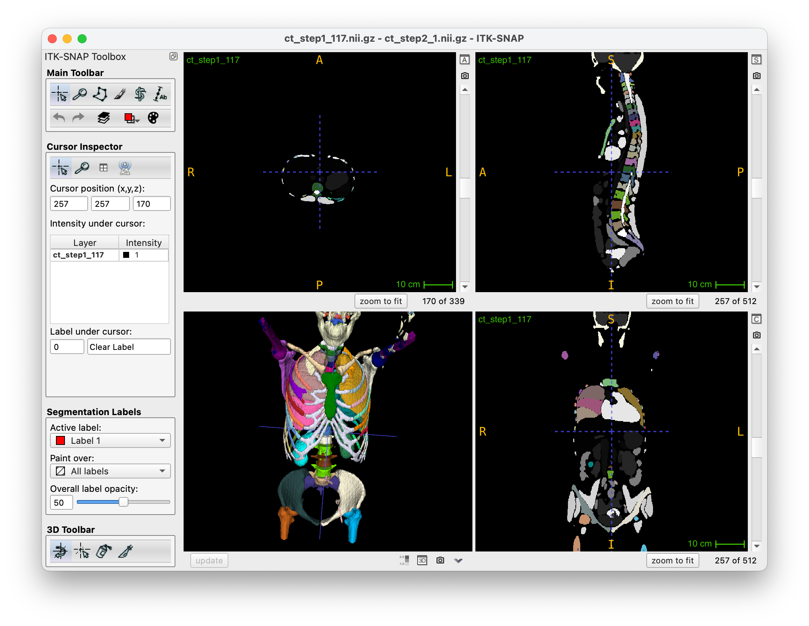
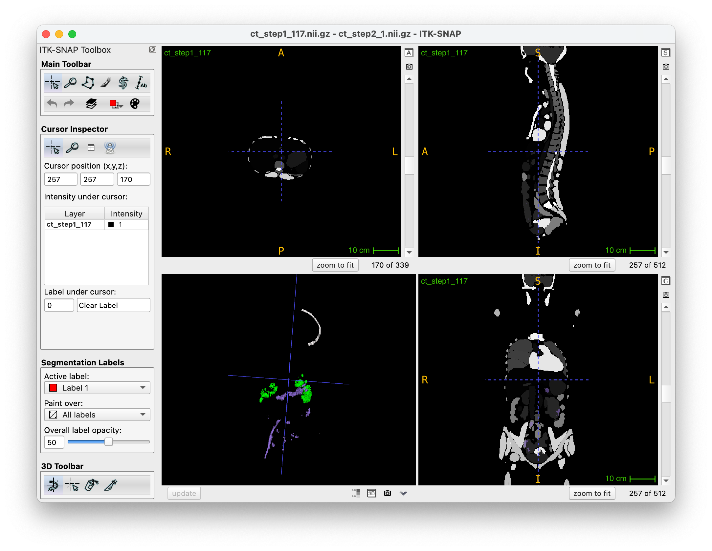

# VISTA3D Inference Pipeline

> Author: Tianyu Lin<br>
> Date: 09/15/2024

To run this inference pipeline, only **⚙️ Requirement** section and **💻 Usage** section are needed. The other sections are for detailed information.


## ⚙️ Requirement
Using Python `venv` to build a virtual environment. 
First, ensure you're using `Python>=3.9`. 
<!-- If you don't have one, `sudo apt install python3.9` should install a Python 3.9 under `/usr/bin/python3.9`. -->
With `/usr/bin/python3.9`, you can first create a venv environment by:
```bash
python3.9 -m venv vista3d_venv
```
Then activate the environment:
```bash
source vista3d_venv/bin/activate
```
The environment should be correctly installed by:
```bash
bash environment.sh
```


## 💻 Usage

In short, VISTA3D can predict 124 (117+7) non-conflict labels. And the [author recommends](https://github.com/Project-MONAI/VISTA/issues/41) segment 7 of the classes (**not included in Touchstone**) in a separate inference stage to prevent noisy output. 

> See details in the  **Label Description** section below.


- Thus, the simplest way to run the inference process is:

```bash
bash run.sh "/path/to/ct_volumes" false     # predict 117 classes
```

where `false` means don't predict the 7 classes. This will run inference process once on each volume with **117 labels.**


- If the 7 other classes are needed, run:

```bash
bash run.sh "/path/to/ct_volumes" true      # predict 117 + 7 = 124 classes
```

This will run the inference process on each volume for two times. It could be slow.


- **The output predictions will be under `./eval`**.


# Appendix

### ❗️ Notes

If encountering OOM problem, go to `./configs/inference.json` and set `"postprocessing#transforms#0#_disabled_": false`. This will move the postprocessing to cpu to reduce the GPU memory footprint. (In my practice, even 24GB will occur OOM sometimes.)

### 📒 Label Description

The [paper of VISTA3D](https://arxiv.org/pdf/2406.05285) states that their model can segment 127 classes.

However, after [consulting with the author](https://github.com/Project-MONAI/VISTA/issues/41), segmenting the total 127 classes at once is not recommended since there is some overlap between certain classes. Specifically,

1. 3 classes contain many of the other classes
    - class "kidney" (label 2) contains "right kidney" (label 5) and "left kidney" (label 14).
    - class "lung" (label 20) contains 5 other classes (label 28, 29, 30, 31, 32).
    - class "bone" (label 21) contains dozens the bone classes.
2. Some tumors and vessels classes can easily overlap with other larger organs and make the prediction noisy
    - 7 of them: "lung, pancreas, hepatic, colon, bone" tumor and "hepatic vessel" and "airway"

As a result, **the total number of classes** is 
$$
\begin{equation}
\begin{aligned}
	\mathbf{124} &=127\text{(stated by VISTA3D)}-3\text{(kidney, lung, bone)}\\
    &=117\text{(prompt given by VISTA3D)}+7\text{(some tumors/vessels)}
\end{aligned}
\end{equation}
$$
The inference process should be separated into two stages: 1. segment 117 classes; 2. segment 7 tumors/vessels classes.

Fortunately, the classes needed for TouchStone benchmark are contained in the first 117 classes. So **the second stage of inference is implemented but not necessary.** The full label dict of this script is in `label_dict_127_touchstone.json`.


### ❌ Collapse in kidney, lung, and bone

By default, if using label prompt 2 for kidney, the model will predict their subclasses (label 5/14) rather than label 2. The following figure shows predictions when using label prompt `[2, 20, 21]`:


However, if we force the model to predict class 2 with label prompt 2 (without subclasses), the model will collapse. The following figures shows predictions using label prompt `[2, 20, 21]`, and forcing model to outbut label `[2, 20, 21]` rather than their subclasses:


As a result, it seems that we don't have to predict these 3 classes after the two-stage predictions shown above.

