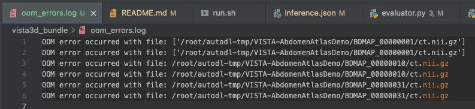
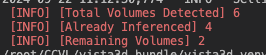
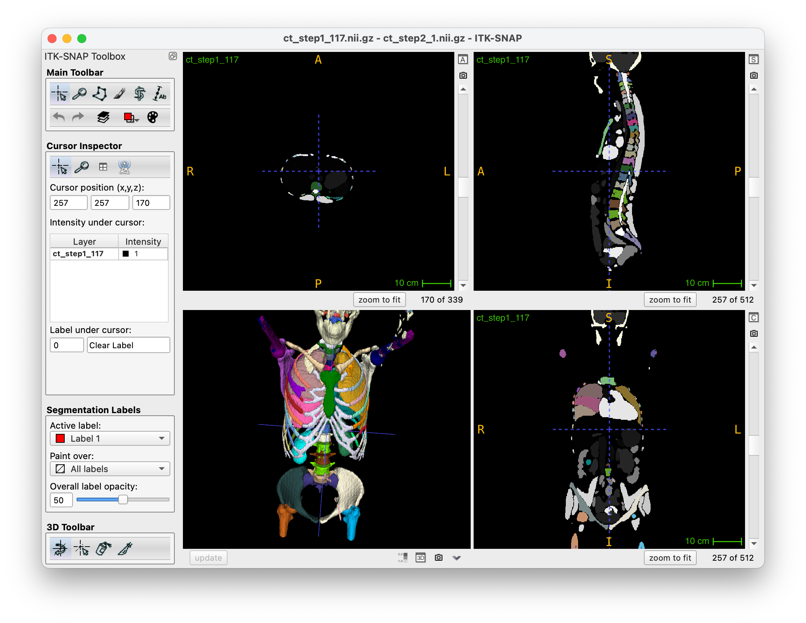
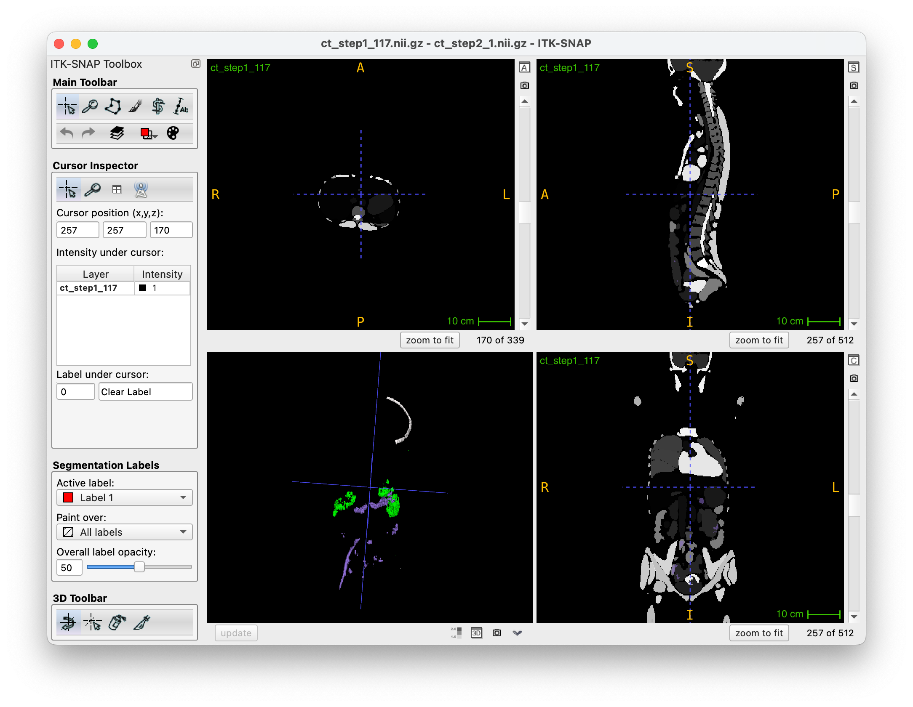

# VISTA3D Inference Pipeline

> Author: Tianyu Lin<br>

To run this inference pipeline, only **⚙️ Requirement** section and **💻 Usage** section are needed. The other sections are for detailed information.

## 📰 News
- Update 09/30/2024:
    1. The name of the volume causing any (hopefully) errors would be capture and log `./errors.log`.
    2. Checking already inferenced volumes by searching input volume in the `eval` folder.
- Update 09/28/2024:
    1. **support logging volume name that cause OOM problem**:
        - When encounter OOM error, the name of the volume causing this error will be highlighted (red) in the output. 
        - Also, this naughty volume will be log into `oom_errors.log`. For example:
        - To continue: delete the volume that cause OOM, and run the inference again.
        > Have been tested on OOM with: model forward stage & postprocessing stage. (2 GPUs)
- Update 09/21/2024:
    1. **support resume from checkpoint feature**: when the inference process is interrupted for any reason, simply run the inference again, the program will resume from the last imcomplete volume.
        - implemented by detecting how many volumes already have 119 label files, and remove theses volumes from the input CT list.
        - sample output: 
    2. fix an error: correct `if num_gpu >= 1 then DDP` to `if num_gpu > 1 then DDP` (in `run.sh`)
- Update 09/18/2024:
    1. **support Multi-GPU inference** (add a param to chose number of GPUs in `run.sh`)
        - tested on two 3090 GPUs with ~2x times inference speed
    2.  add description on `nohup` for logging the command line output in `nohup.out`.
    - TODO: resume from checkpoint feature
- Update 09/17/2024: 
    1. solve environment issue;
    2. only need to load model once;
    3. solve label name conflict issue (small bowel -> intestine, other classes are fine);
    4. add two classes: `lung_left` and `lung_right` (merged from their lobes), so will have `117 + 2 = 119` classes in total;
    5. modify "label description" section to explain label name conflicts with Touchstone benchmark.
    - TODO: add logger/resume from checkpoint feature.
    - NOTE: second stage for inference on 7 other classes is deprecated temporarily.

## ⚙️ Requirement
Using Python `venv` to build a virtual environment. 
First, ensure you're using `Python>=3.9`. 
<!-- If you don't have one, `sudo apt install python3.9` should install a Python 3.9 under `/usr/bin/python3.9`. -->
With `/usr/bin/python3.9`, you can first create a venv environment by:
```bash
python3.9 -m venv vista3d_venv
```
Then activate the environment:
```bash
source vista3d_venv/bin/activate
```
The environment should be correctly installed by:
```bash
bash environment.sh
```


## 💻 Usage

In short, VISTA3D can predict 124 (117+7) non-conflict labels. And the [author recommends](https://github.com/Project-MONAI/VISTA/issues/41) segment 7 of the classes (**not included in Touchstone**) in a separate inference stage to prevent noisy output. (See details in the  **Label Description** section below.)

- Thus, run the inference process like:

```bash
# predict 117  + 2  (left/right lung) = 119 classes
bash run.sh "/path/to/ct_volumes" false num_gpus
```
where: 
1. `"/path/to/ct_volumes"` denotes the absolute path to ct volumes
2. `false` means doesn't use second stage inference for the other 7 classes
3. `num_gpus` denotes the number of GPU(s) used for inference. Set `num_gpus` to 1 to start single-GPU inference, and set `num_gpus` to 4 to start 4-GPUs inference (with DDP). 

What's more, using `nohup` is strongly recommanded:
```bash
# predict 117  + 2  (left/right lung) = 119 classes
nohup bash run.sh "/path/to/ct_volumes" false num_gpus > nohup.out 2>&1 &
```
this will save all the command line output to `nohup.out`. This log file can also be seen in real time using the following command: `tail -f nohup.out`.

<!-- - If the 7 other classes are needed, run:

```bash
bash run.sh "/path/to/ct_volumes" true      # predict 117 + 7 = 124 classes
```

This will run the inference process on each volume for two times. It could be slow. -->


- **The output predictions will be under `./eval`**.


# Appendix

### ❗️ Notes

If encountering OOM problem, go to `./configs/inference.json` and set `"postprocessing#transforms#0#_disabled_": false`. This will move the postprocessing to cpu to reduce the GPU memory footprint. (In my practice, even 24GB will occur OOM sometimes.)

### 📒 Label Description

The [paper of VISTA3D](https://arxiv.org/pdf/2406.05285) states that their model can segment 127 classes.

However, after [consulting with the author](https://github.com/Project-MONAI/VISTA/issues/41), segmenting the total 127 classes at once is not recommended since there is some overlap between certain classes. Specifically,

1. 3 classes contain many of the other classes
    - class "kidney" (label 2) contains "right kidney" (label 5) and "left kidney" (label 14).
    - class "lung" (label 20) contains 5 other classes (label 28, 29, 30, 31, 32).
    - class "bone" (label 21) contains dozens the bone classes.
2. Some tumors and vessels classes can easily overlap with other larger organs and make the prediction noisy
    - 7 of them: "lung, pancreas, hepatic, colon, bone" tumor and "hepatic vessel" and "airway"

As a result, **the total number of classes** is 

$$
\begin{equation}
\begin{aligned}
	\mathbf{124} &=127\text{(stated by VISTA3D)}-3\text{(kidney, lung, bone)}\\
    &=117\text{(prompt given by VISTA3D)}+7\text{(some tumors/vessels)}
\end{aligned}
\end{equation}
$$

The inference process should be separated into two stages: 1. segment 117 classes; 2. segment 7 tumors/vessels classes.

Fortunately, the classes needed for TouchStone benchmark are contained in the first 117 classes. So **the second stage of inference is implemented but not necessary.** The full label dict of this script is in `label_dict_127_touchstone.json`.

> After thorough check, 
> 1. VISTA3D doesn't support `celiac_trunk` and `rectum` in Touchstone benchmark.
> 2. `lung_left` is merged by its upper and lower lobes, `lung_right` is merged by its upper, middle and lower lobes.
> 3. all 5 of the lung lobes are retained.


### ❌ Collapse in kidney, lung, and bone

By default, if using label prompt 2 for kidney, the model will predict their subclasses (label 5/14) rather than label 2. The following figure shows predictions when using label prompt `[2, 20, 21]`:


However, if we force the model to predict class 2 with label prompt 2 (without subclasses), the model will collapse. The following figures shows predictions using label prompt `[2, 20, 21]`, and forcing model to outbut label `[2, 20, 21]` rather than their subclasses:


As a result, it seems that we don't have to predict these 3 classes after the two-stage predictions shown above.

